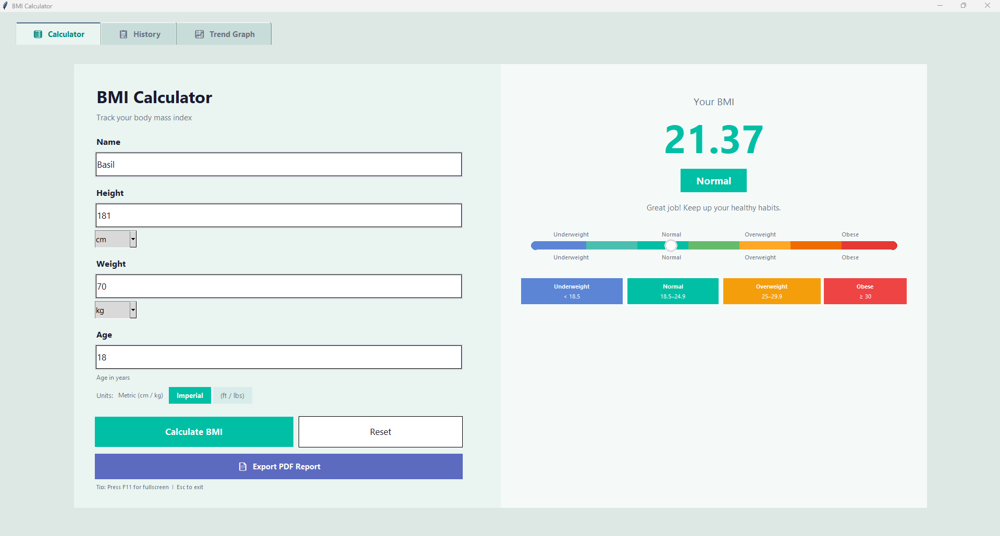

<div align="center">

# 🏃 BMI Calculator

### A professional desktop Body Mass Index tracker built with Python & Tkinter

[](https://www.python.org/)
[](https://docs.python.org/3/library/tkinter.html)
[](https://matplotlib.org/)
[](https://www.reportlab.com/)
[](LICENSE)

---

> Calculate your BMI instantly · Track history over time · Export professional PDF health reports

</div>

---

## 📸 Screenshots

### 🧮 Calculator Tab


### 📄 PDF Report Samples
| Underweight Report | Normal Report | Overweight Report |
|:-:|:-:|:-:|
|  |  |  |

---

## ✨ Features

**Core Calculation**
- Instant BMI calculation with colour-coded result display
- Supports **Metric** (cm / kg) and **Imperial** (ft / lbs) unit systems
- Input units: kg, grams, lbs, oz for weight · cm, m, feet, inches for height
- Smart input validation — catches unrealistic or missing values

**Visual Feedback**
- Live colour-gradient BMI gauge slider
- Category pill badge (Underweight / Normal / Overweight / Obese)
- Highlighted classification cards that update on every calculation

**History & Trends**
- All results auto-saved locally to `bmi_history.csv`
- History tab with colour-coded rows and a timestamp for every entry
- Trend Graph tab — interactive line chart filterable by name
- Clear All option to wipe history

**PDF Report Export**
- Two-page professional PDF report with teal-themed design
- Includes: BMI result card, measurements table, classification table
- Personalised health tips per BMI category
- BMI trend chart embedded in the PDF (requires 2+ history entries)
- Auto-opens the PDF after export on Windows, macOS, and Linux

**Window & UX**
- Launches maximised; `F11` for true fullscreen, `Esc` to exit
- Clean tabbed layout — Calculator · History · Trend Graph

---

## 📁 Project Structure

```
OIBSIP_Python_T2/
│
├── main.py                  ← Entry point — run this to launch the app
│
├── Constant and Theme.py    ← Colour palette, BMI categories & health tips
├── Core.py                  ← BMI logic: unit conversion, calculation, validation
├── GUI.py                   ← Full Tkinter UI (tabs, panels, gauge, widgets)
├── History.py               ← CSV read / write / clear operations
├── PDF Generator.py         ← ReportLab PDF report builder
│
├── Screenshot.png           ← Calculator tab screenshot
├── Screenshot 1.png         ← PDF report — Underweight sample
├── Screenshot 2.png         ← PDF report — Normal sample
├── Screenshot 3.png         ← PDF report — Overweight sample
├── T2_Demo.mp4              ← Full demo video
│
└── README.md
```

---

## ⚙️ Requirements

- **Python 3.8+**
- `tkinter` — bundled with Python on Windows and macOS (Linux: `sudo apt install python3-tk`)
- `matplotlib`
- `reportlab`

---

## 🚀 Installation & Running

**1. Clone the repository**
```bash
git clone https://github.com/1BasilShaju1/OIBSIP_Python_T2.git
cd OIBSIP_Python_T2
```

**2. Install dependencies**
```bash
pip install matplotlib reportlab
```

**3. Launch the app**
```bash
python main.py
```

> The app opens maximised and is ready to use immediately.

---

## 🖥️ How to Use

### Calculator Tab
1. Enter your **Name**, **Height**, and **Weight**
2. Select units from the dropdowns or toggle **Metric ↔ Imperial**
3. Click **Calculate BMI** — result, category badge, and gauge update instantly
4. Click **📄 Export PDF Report** to save and auto-open a detailed health report
5. Click **Reset** to clear all fields back to defaults

### History Tab
- Opens automatically populated with all past calculations
- Rows are colour-coded: 🔵 Underweight · 🟢 Normal · 🟡 Overweight · 🔴 Obese
- **🗑 Clear All** permanently deletes history

### Trend Graph Tab
- Line chart of your BMI over time with colour-banded healthy zones
- Use the **Filter by name** dropdown to isolate a specific user's data

---


## 📊 BMI Classification

| Category | BMI Range | Status |
|---|---|---|
| 🔵 Underweight | < 18.5 | Below healthy range |
| 🟢 Normal | 18.5 – 24.9 | Healthy range ✓ |
| 🟡 Overweight | 25.0 – 29.9 | Above healthy range |
| 🔴 Obese | ≥ 30.0 | High health risk |

---

## 🎬 Demo

[](T2_Demo.mp4)

> Download or view `T2_Demo.mp4` from the repository for a full walkthrough.

---


## 👨‍💻 Author

**Basil Shaju**


---

<div align="center">

Made with 🩺 and Python · Part of OIBSIP Python Internship — Task 2

</div>
